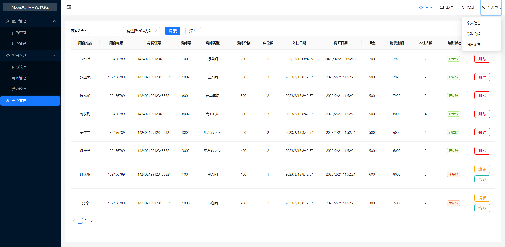
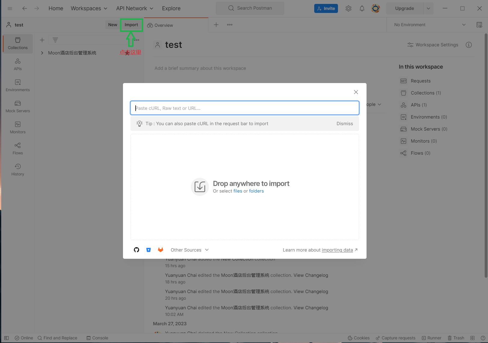

# **Hotel-Manager**
## **1. 项目简介**
&emsp;&emsp;本项目是一个简单的酒店后台管理系统DEMO，参考了[尚硅谷的React实战视频](https://www.bilibili.com/video/BV1HM41127ts?p=1&vd_source=b663bb0bb5b26e2d0fa24f08657f6478)，实现了账户管理、客房管理、客户管理、个人信息修改等主要功能，并在其基础上添加了房型管理、房间管理和客户管理的信息交互。

 &emsp;前端使用React框架，使用到技术主要为React18+Redux+Router6+Antd+Echarts。后端使用Node.js搭建本地服务器，数据库使用简单好用的本地数据接口 [json-server](https://github.com/typicode/json-server)。
 
&emsp;【注】Node.js server目前写的是依托答辩，后续会将MySQL加入到Node.js中。

## **2. 开发环境配置**
&emsp;&emsp;运行本项目首先需要已安装[Node.js](https://nodejs.org/en)，编译器推荐使用[VS Code](https://code.visualstudio.com/)。
#### **3.1 安装依赖项** 
      1. $ git clone git@github.com:ChaiYuanYuan-bit/Hotel-Manager.git
      2. $ cd Hotel-Manager
      3. $ npm i
#### **3.2 安装 [Json-Server](https://github.com/typicode/json-server)**
        $ npm install -g json-server
## **3. 运行项目**
        运行 React
            1. $ cd Hotel-Manager
            2. $ npm run start
        运行 Node.js server
            3. $ cd ./服务器/server
            4. $ node .\server.js
        运行 json-server
            5. $ cd ./服务器/Database
            6. $ json-server --watch db.json --port 3004【为了防止与3000端口冲突，这里将json-server开在了3004端口】
            到这里，项目应该已经可以跑起来了 :）
              账户名：admin
              密码：123321
## **4. 配置Postman【可选】**
&emsp;&emsp;下载[Postman](https://www.postman.com/)并注册账号，在自己的collection下导入[json文件](./服务器/Postman)

## **5. 目录结构**
- `src`
  
  - `api`&emsp;Api接口文件
    |**api文件夹**|**api描述**|
    |:----:|:-:|
    |`adminApi.js`|用户管理Api|
    |`guestApi.js`|客户管理Api|
    |`roletApi.js`|角色管理Api|
    |`roomApi.js`|房间管理Api|
    |`stateApi.js`|房间状态Api|
    |`typeApi.js`|房型管理Api|
  
  - `components`&emsp;组件文件
    
    - `MyNotification`&emsp;系统提醒框组件，封装了[antd的Noteification组件](https://ant.design/components/notification-cn#notificationconfig)
  - `config`&emsp;配置文件
  - `redux` &emsp;保存登录信息的redux，使用了[Redux Toolkit](https://redux-toolkit.js.org/)中的[createSlice](https://redux-toolkit.js.org/api/createSlice)（比react-redux-dom好用）
  - `routes`&emsp;路由表配置文件，搭配[useRoutes Hook](https://reactrouter.com/en/main/hooks/use-routes#useroutes)实现集中式的路由管理
  - `utils`  &emsp;公共方法
  - `views` &emsp;页面文件（pages）
    
    |**views文件夹**|**页面描述**|
    |:----:|:-:|
    |`Login`|登陆页面|
    |`Layout`|主界面|
    |`Admin`|用户管理|
    |`Role`|角色管理|
    |`Type`|房型管理|
    |`TotalPrice`|营业统计|
    |`Room`|房间管理|
    |`Guest`|客户管理|
- `App.jsx`
- `index.js`
- `setupProxy.js`&emsp;配置代理，解决本地开发时的跨域问题
- `.env.build`&emsp;package.json中的"build": "env-cmd -f .env.build react-scripts build"语句可以传递一个.env.build中的参数，可以实现在start、dev、build等环境下使用不同的配置（可以参考./config/index.js中process.env.REACT_APP_TYPE这个条件），具体使用方法参考[env-cmd](https://www.gingerdoc.com/tutorials/nodejs-take-command-with-env-cmd)。
- `服务器`
  
  - `DataBase json-server`
  - `Postman Postman测试接口`
  - `Server Node.js server`
## **6. 后续工作**
    1. 在Node.js server中添加MySQL数据库，使用SQL语句替换Axios请求。
    2. 将项目部署至Centos，使用Nginx解决服务端的跨域问题。
## **7. 更新日志**
- 2023-03-29 完成酒店后台管理系统前端部分
